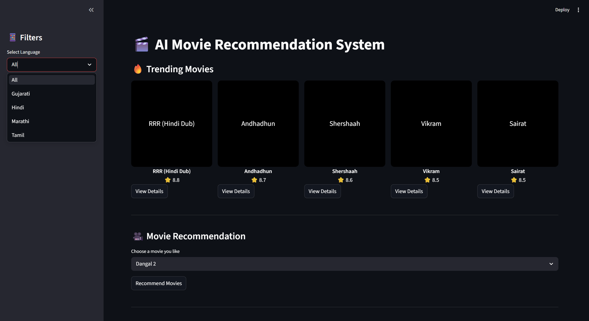
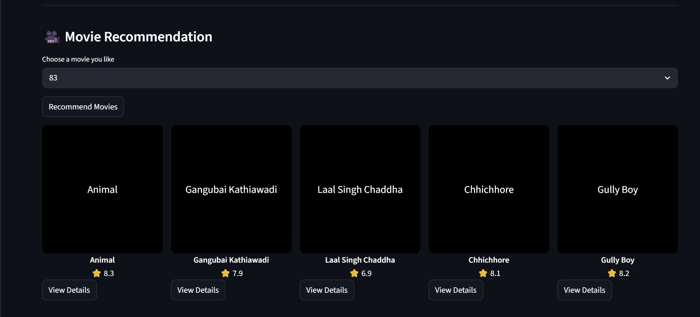
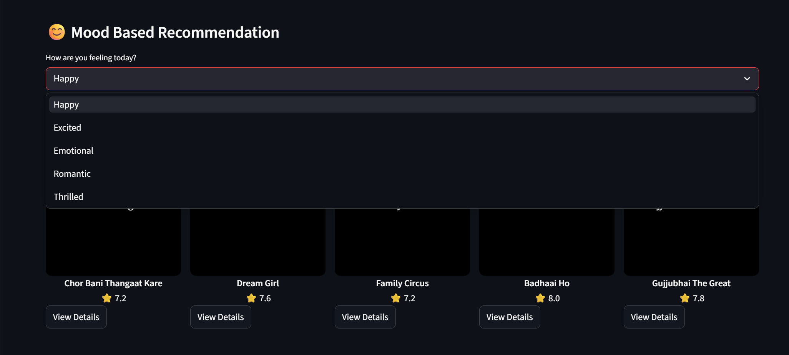
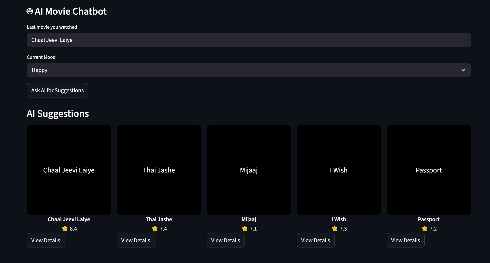

# 🎬 AI Movie Recommendation System
This project is a Machine Learning based movie recommendation system built using Python and Streamlit.

## Features
- Trending Movies
- Movie Recommendation using Cosine Similarity
- Mood Based Recommendation
- Language Filter
- AI Chatbot Movie Suggestion
- Movie Details Page

## Technologies Used
- Python
- Pandas
- Scikit-learn
- Streamlit

## How to Run
Install dependencies:
pip install -r requirements.txt

Run application:
streamlit run app.py
## Application Screenshots

1. ### Home Page

2. ### Movie Recommendation

3. ### Mood Based Recommendation

## Author
Tirth Patel
B.Tech AI & Data Science

4. ### AI Chatbot

